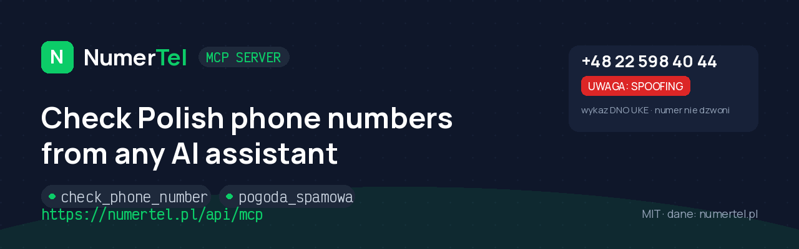

**English** · [Polski](#numertel-mcp-server-po-polsku)

# NumerTel MCP Server

Check **Polish phone numbers** from any AI assistant: who called, is it spam or
a scam, is this really a bank's number — plus live phone-abuse stats for Poland.

Backed by [NumerTel.pl](https://numertel.pl): 130M numbers built on official
UKE numbering ranges, user reports, the state **DNO registry** and CERT
Polska's public Warning List.

[](LICENSE)
[](https://numertel.pl/dla-deweloperow)
[](https://registry.modelcontextprotocol.io/v0/servers?search=numertel)

[](https://cursor.com/en/install-mcp?name=numertel&config=eyJ1cmwiOiJodHRwczovL251bWVydGVsLnBsL2FwaS9tY3AifQ==)
[](https://insiders.vscode.dev/redirect/mcp/install?name=numertel&config=%7B%22type%22%3A%22http%22%2C%22url%22%3A%22https%3A%2F%2Fnumertel.pl%2Fapi%2Fmcp%22%7D)

## Remote server (recommended)

One endpoint, zero install:

```
https://numertel.pl/api/mcp
```

Generic config that works in most MCP clients:

```json
{
  "mcpServers": {
    "numertel": {
      "type": "http",
      "url": "https://numertel.pl/api/mcp"
    }
  }
}
```

<details>
<summary><b>Claude Code</b></summary>

```bash
claude mcp add --transport http numertel https://numertel.pl/api/mcp
```
</details>

<details>
<summary><b>Cursor</b></summary>

Use the install button above, or add to `~/.cursor/mcp.json`:

```json
{
  "mcpServers": {
    "numertel": { "url": "https://numertel.pl/api/mcp" }
  }
}
```
</details>

<details>
<summary><b>VS Code</b></summary>

Use the install button above, or add to `mcp.json`:

```json
{
  "servers": {
    "numertel": { "type": "http", "url": "https://numertel.pl/api/mcp" }
  }
}
```
</details>

<details>
<summary><b>Claude Desktop (or any client without native streamable HTTP)</b></summary>

```json
{
  "mcpServers": {
    "numertel": {
      "command": "npx",
      "args": ["mcp-remote", "https://numertel.pl/api/mcp"]
    }
  }
}
```
</details>

Transport: streamable HTTP (JSON-RPC 2.0). Limit: 30 requests/day/IP.

## Try asking your assistant

- "Who called me from 500 100 200?"
- "Is +48 22 598 40 44 really my bank, or a scam?"
- "How bad is phone phishing in Poland today?"

## Tools

- **check_phone_number** — full reputation card for a Polish number: operator
  (original UKE range, MNP note), risk label from user reports, UKE **DNO
  registry** status (an *incoming* call from a DNO number is spoofed by
  definition), verified official-hotline whitelist, report counts.
  Inputs: `number` (string, 9 digits). Read-only, structured output.
- **pogoda_spamowa** — phone-abuse indicators for Poland: new scam domains on
  CERT Polska's Warning List (today + daily series), DNO registry size and the
  latest numbers from official warnings. Inputs: `days` (1-30, default 7).
  Read-only, structured output, open data (CC-BY).
- **check_scam_domain** — checks whether a domain, link or email address
  appears on CERT Polska's official Warning List (a mirror of ~129k scam
  domains). Accepts a single domain/URL/email or a whole pasted message
  (domains are extracted, incl. `evil[.]pl` / `hxxp://`); suffix match, so
  `login.evil.pl` hits `evil.pl`. Deterministic verdict with the listing
  date. Read-only, structured output.
- **search** — a Polish phone number OR an institution name (returns verified
  official hotlines from the whitelist). ChatGPT deep-research compatible.
- **fetch** — full card by `id` from search results.

## Prompts

Ready-made actions that appear in Claude's "+" menu under the NumerTel brand:
`sprawdz_numer` (full number analysis with fresh embedded data),
`przeanalizuj_sms` (scam analysis of a pasted SMS — runs on the client's
model), `pogoda_spamowa_dzis` (today's phone-abuse report for Poland).

## Also works in

- **ChatGPT** (Plus/Pro, incl. Poland): Settings -> Apps & Connectors ->
  Advanced -> Developer mode -> Create connector -> paste
  `https://numertel.pl/api/mcp` (No authentication).
- **Gemini CLI**: `{"mcpServers":{"numertel":{"httpUrl":"https://numertel.pl/api/mcp"}}}`
- **Microsoft Copilot Studio**: Tools -> Add Tool -> MCP -> paste the URL.

Higher limits: API key via `Authorization: Bearer` header
(kontakt@numertel.pl).

Example response (shortened):

```json
{
  "number": "225984044",
  "operator": "Strefa Warszawa",
  "spam_label": "dno_spoofing",
  "is_dno": true,
  "dno_note": "Numer służy wyłącznie do odbierania połączeń (wykaz DNO UKE)...",
  "url": "https://numertel.pl/numer/225984044"
}
```

## Local stdio server (single file, zero dependencies)

For clients that only support stdio. Requires Node 18+. Download
[`numertel-mcp.mjs`](https://numertel.pl/numertel-mcp.mjs) (also in this repo):

```json
{
  "mcpServers": {
    "numertel": {
      "command": "node",
      "args": ["/path/to/numertel-mcp.mjs"],
      "env": { "NUMERTEL_API_KEY": "(optional, for higher limits)" }
    }
  }
}
```

## REST API

The same data over plain REST — see the
[developer docs](https://numertel.pl/dla-deweloperow) (Polish):
`GET https://numertel.pl/api/v1/check/{number}` (20 req/day/IP without a key)
and `GET https://numertel.pl/api/v1/spam-weather` (no limit, CC-BY).
Higher limits / API keys: kontakt@numertel.pl

## Troubleshooting

- **Client doesn't support remote MCP servers** — use the `mcp-remote` bridge
  (see Claude Desktop above) or the local stdio file.
- **HTTP 429** — the free daily limit was reached; try tomorrow or ask for a key.
- **"Numer spoza znanych zakresów" (404)** — the number is outside Polish
  numbering ranges; pass 9 digits in national format.

## Privacy

The server is read-only and returns only data already public on
numertel.pl number pages — never opinion contents, never personal data.
Queries are not logged beyond anonymous daily rate-limit counters.
Attribution "dane: numertel.pl" with a link is required when presenting
results publicly; aggregate datasets are CC-BY 4.0.

## License

MIT (this client and manifest). The NumerTel.pl service itself is a separate,
proprietary product.

---

# NumerTel MCP Server (po polsku)

Sprawdzaj **polskie numery telefonów** z poziomu dowolnego asystenta AI: kto
dzwonił, czy to spam lub oszustwo, czy numer naprawdę należy do banku. Do tego
bieżące wskaźniki nadużyć telefonicznych w Polsce.

Za serwerem stoi [NumerTel.pl](https://numertel.pl): 130 mln numerów na bazie
oficjalnych zakresów UKE, opinie użytkowników, państwowy **wykaz DNO** i jawna
Lista Ostrzeżeń CERT Polska.

## Serwer zdalny (zalecany)

Jeden adres, zero instalacji:

```
https://numertel.pl/api/mcp
```

Konfiguracja działająca w większości klientów MCP:

```json
{
  "mcpServers": {
    "numertel": {
      "type": "http",
      "url": "https://numertel.pl/api/mcp"
    }
  }
}
```

W Claude Code wystarczy: `claude mcp add --transport http numertel https://numertel.pl/api/mcp`.
Przyciski szybkiej instalacji dla Cursor i VS Code znajdziesz na górze strony.
Transport: streamable HTTP (JSON-RPC 2.0). Limit: 30 zapytań dziennie na adres IP.

## Zapytaj asystenta

- „Kto dzwonił z numeru 500 100 200?"
- „Czy 22 598 40 44 to prawdziwy numer banku, czy oszustwo?"
- „Jaka jest dziś skala phishingu w Polsce?"

## Narzędzia

- **check_phone_number** zwraca operatora (pierwotny zakres UKE z notą o
  przenośności), etykietę ryzyka z opinii, status w wykazie DNO UKE
  (połączenie *przychodzące* z numeru DNO jest z definicji sfałszowane),
  wpis z Białej Listy oficjalnych infolinii i liczniki zgłoszeń.
  Wejście: `number` (string, 9 cyfr, `+48` i spacje są usuwane). Tylko odczyt.
- **pogoda_spamowa** zwraca bieżące wskaźniki nadużyć w Polsce: nowe domeny
  oszustów na Liście Ostrzeżeń CERT (dziś / 7 / 30 dni) i rozmiar wykazu DNO.
  Bez parametrów. Tylko odczyt, dane otwarte (CC-BY).

## Wariant lokalny (stdio, jeden plik)

Dla klientów obsługujących wyłącznie stdio. Wymaga Node 18+. Pobierz
[`numertel-mcp.mjs`](https://numertel.pl/numertel-mcp.mjs) (plik jest też w tym repo):

```json
{
  "mcpServers": {
    "numertel": {
      "command": "node",
      "args": ["/sciezka/do/numertel-mcp.mjs"],
      "env": { "NUMERTEL_API_KEY": "(opcjonalnie, wyzszy limit)" }
    }
  }
}
```

## REST API

Te same dane przez zwykły REST, dokumentacja:
[numertel.pl/dla-deweloperow](https://numertel.pl/dla-deweloperow).
`GET https://numertel.pl/api/v1/check/{numer}` (20 zapytań/dzień/IP bez klucza)
oraz `GET https://numertel.pl/api/v1/spam-weather` (bez limitu, CC-BY).
Wyższe limity i klucze API: kontakt@numertel.pl

## Rozwiązywanie problemów

- **Klient nie wspiera zdalnych serwerów MCP**: użyj mostka `mcp-remote`
  (sekcja Claude Desktop wyżej) albo pliku stdio.
- **HTTP 429**: wyczerpany dzienny limit darmowy, spróbuj jutro lub napisz po klucz.
- **„Numer spoza znanych zakresów" (404)**: numer jest spoza polskiej numeracji,
  podaj 9 cyfr w formacie krajowym.

## Prywatność

Serwer działa tylko w trybie odczytu i zwraca wyłącznie dane publicznie widoczne
na stronach numerów w numertel.pl. Nigdy treści opinii, nigdy danych osobowych.
Zapytania nie są logowane poza anonimowymi licznikami limitów. Przy publicznej
prezentacji wyników wymagana jest atrybucja „dane: numertel.pl" z linkiem.

## Licencja

MIT (ten klient i manifest). Sam serwis NumerTel.pl jest osobnym, zamkniętym
produktem.
